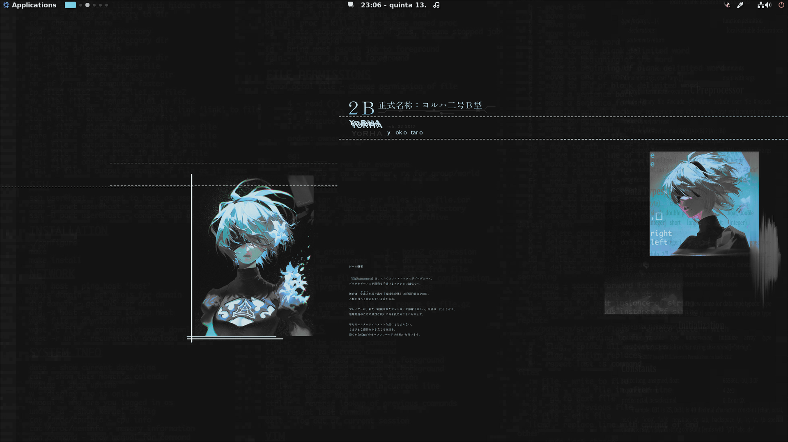
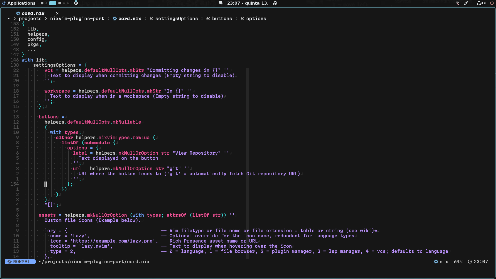

<h1 align="center">
<a href='#'></a>
  <br>
  <div>
    <a href="https://github.com/redyf/nixdots/issues">
        
    </a>
    <a href="https://github.com/redyf/nixdots/stargazers">
        
    </a>
    <a href="https://github.com/redyf/nixdots">
        
    </a>
    <a href="https://github.com/redyf/nixdots/LICENSE">
        
    </a>
    <br>
    </div>
        
   </h1>

<div align="center">
<h1>
❄️ NixOS dotfiles ❄️
</h1>
</div>
<h2 align="center">NixOS system configuration. Feel free to explore!</h2>

```mint
⠀⠀   🌸 Setup / Hyprland 🌸
 -----------------------------------
 ╭─ Distro  -> NixOS
 ├─ Editor  -> Neovim
 ├─ Browser -> Firefox
 ├─ Shell   -> ZSH
 ╰─ Resource Monitor -> Btop
 ╭─ Model -> DELL XPS 8940
 ├─ CPU   -> Intel i5-10400f @ 4.3GHz
 ├─ GPU   -> NVIDIA GeForce GTX 1650 SUPER
 ╰─ Resolution -> 1920x1080@165hz
 ╭─ WM       -> Hyprland
 ├─ Terminal -> Kitty
 ├─ Theme    -> Oxocarbon
 ├─ Icons    -> Papirus-Dark
 ├─ Font     -> SFMono Ligaturized
 ╰─ Hotel    -> Trivago
                        
```

<hr>

<div align="center">




</div>

<hr>

## Commands you should know:

- Rebuild and switch to change the system configuration (in the configuration directory):

```
nh os switch
```

OR

```
sudo nixos-rebuild switch --flake '.#redyf'
```

- Connect to internet (Change what's inside the brackets with your info).

```
iwctl --passphrase [passphrase] station [device] connect [SSID]
```

## Installation

> [!CAUTION]
> This hosts system and home configurations are public for your own learning and
> research. They are not meant to be used with any hardware other than mine.
> Trying to build and deploy them to other systems without appropriate changes
> can render your machines unbootable and damage data.

I'll guide you through the Installation, but first make sure to download the Minimal ISO image available at [NixOS](https://nixos.org/download#nixos-iso) and make a bootable drive with it. I suggest using [Rufus](https://rufus.ie/en/) for the task as it's a great software,
and an ethernet cable to make things easier. We shall begin!

<details>
    <summary>Installation Steps</summary>

<strong>

Only follow these steps after using the bootable drive, changing BIOS boot priority and getting into the installation!

</strong>

```
First part:
video=1920x1080
setfont ter-128n
configure networking as needed (skip this if you're using ethernet)
sudo -i
lsblk (check info about partitions and the device you want to use for the installation)
gdisk /dev/vda (change according to your system, for me it's /dev/nvme0n1)
then configure 600M type ef00, rest ext4 type 8300 as described below
Type "n" to make a new partition, choose the partition number, first sector can be default but last sector should be 600M. Hex code for EFI is ef00.
Now type n again to make another partition, this time we'll leave everything as default. After finishing these steps, make sure to write it to the disk by typing "w".
lsblk
mkfs.fat -F 32 -n boot /dev/vda1 (Format the partitions)
mkfs.ext4 -L nixos /dev/vda2
mount /dev/disk/by-label/nixos /mnt (Mount partitions)
mkdir /mnt/boot (Create a directory for boot)
mount /dev/disk/by-label/boot /mnt/boot
```

After mounting the partitions, you can move to the second part...

```
# go inside a nix shell with the specified programs
nix-shell -p git nixUnstable neovim
# create this folder if necessary
mkdir -p /mnt/etc/
# clone the repo
git clone https://github.com/redyf/nixdots.git /mnt/etc/nixos --recurse-submodules
# remove this file
rm /mnt/etc/nixos/hosts/redyf/hardware-configuration.nix
# generate the config and take some files
nixos-generate-config --root /mnt
rm /mnt/etc/nixos/configuration.nix
mv /mnt/etc/nixos/hardware-configuration.nix /mnt/etc/nixos/hosts/redyf/
# make sure you're in this path
cd /mnt/etc/nixos
# Install my config:
nixos-install --flake '.#redyf'
# Obs:
If you'd like to use my config as a template, all you need to do is replace "redyf" with your username.
```

</details>
<hr>

Disko is also available for formatting partitions (Only for advanced users)

<details>
<summary>Disko</summary>

If you save disko's config file in **./disks/default.nix**, and run the following command:

```nix
sudo nix --experimental-features "nix-command flakes" run github:nix-community/disko -- --mode disko ./disks/default.nix --arg device '/dev/nvme0n1'
```

you will partition, format and mount the disk for /dev/nvme0n1 (change as needed).

</details>

<hr>

## NixOS Raspberry PI5 Installation

### Requirements

- rpi-imager
- sd-card
- Raspberry Pi 5
- Another device to connect remotely (PC, Laptop, etc)

### Installation Steps

1. **Open rpi-imager** and select your device, then Raspberry PI OS and sd-card.
2. **Customize settings** to your needs, like defining a user/hostname and enabling ssh.
3. **Insert the sd-card** in your Raspberry PI and boot.

4. **Install Nix** on it by running the following command:

```bash
bash <(curl -L https://nixos.org/nix/install)
```

5. **Install Cachix client** by running:

```bash
nix-env -iA cachix -f https://cachix.org/api/v1/install
```

6. **Start using the binary cache** by running:

```bash
cachix use raspberry-pi-nix
```

7. **Clone the following repo**:

```bash
git clone https://github.com/tstat/raspberry-pi-nix-example
```

8. **Update flake inputs** by running:

```bash
nix flake update
```

9. **Customize `flake.nix`** to match your needs, like changing hostname, timezones, enabling nmcli, etc.

10. **Build an image** suitable for flashing to an sd-card by running:

```
nix build '.#nixosConfigurations.rpi-example.config.system.build.sdImage'
```

11. **Connect to your main machine** with ssh and copy the image to it using scp. You can use the following commands:

```
scp /path/to/file username@a:/path/to/destination
```

or

```
scp username@b:/path/to/file /path/to/destination
```

12. **Use rpi-imager** again and select the image you just built to be installed on Raspberry PI.

13. **Enjoy!** (My RaspberryPI5 host is in this repo, it's called selene. Just in case you want a working profile with Sway installed out of the box).

All references are written below. I wouldn't be able to install it without them! I really appreciate their hard work, make sure to give them a star.

<hr>

## All references/credits for the NixOS Raspberry PI 5 setup:

- [Raspberry PI 5 support](https://github.com/NixOS/nixpkgs/issues/260754)
- [NixOS on ARM/Raspberry Pi 5](https://wiki.nixos.org/wiki/NixOS_on_ARM/Raspberry_Pi_5)
- [Pi 5 support](https://github.com/nix-community/raspberry-pi-nix/issues/13)
- [raspberry-pi-nix](https://github.com/nix-community/raspberry-pi-nix?tab=readme-ov-file)
- [raspberry-pi-nix binary cache](https://app.cachix.org/cache/raspberry-pi-nix)
- [nix-rpi5](https://gitlab.com/vriska/nix-rpi5)
- [raspberrypi/firmware](https://github.com/raspberrypi/firmware)

## Shoutout to:

- [AlphaTechnolog](https://github.com/AlphaTechnolog/nixdots)
- [Eriim's](https://github.com/erictossell/nixflakes)
- [IogaMaster](https://github.com/IogaMaster)
- [linuxmobile](https://github.com/linuxmobile)
- [NotAShelf](https://github.com/NotAShelf/nyx)
- [notusknot](https://github.com/notusknot)
- [Siduck76](https://github.com/siduck76/nvchad/)
- [Sioodmy](https://github.com/sioodmy/dotfiles)
- [Stephenstechtalks](https://github.com/stephenstechtalks)
- [ZerotoNix](https://zero-to-nix.com)
- [NobbZ](https://github.com/NobbZ)

<hr>

## Conclusion

That should be all! If you have any problem, feel free to make an issue in the github repo. (https://github.com/Redyf/nixdots/issues).

The code is licensed under the MIT license, so you can use or distribute the code however you like. If you have any questions, contact me on Discord: `redyf`.
