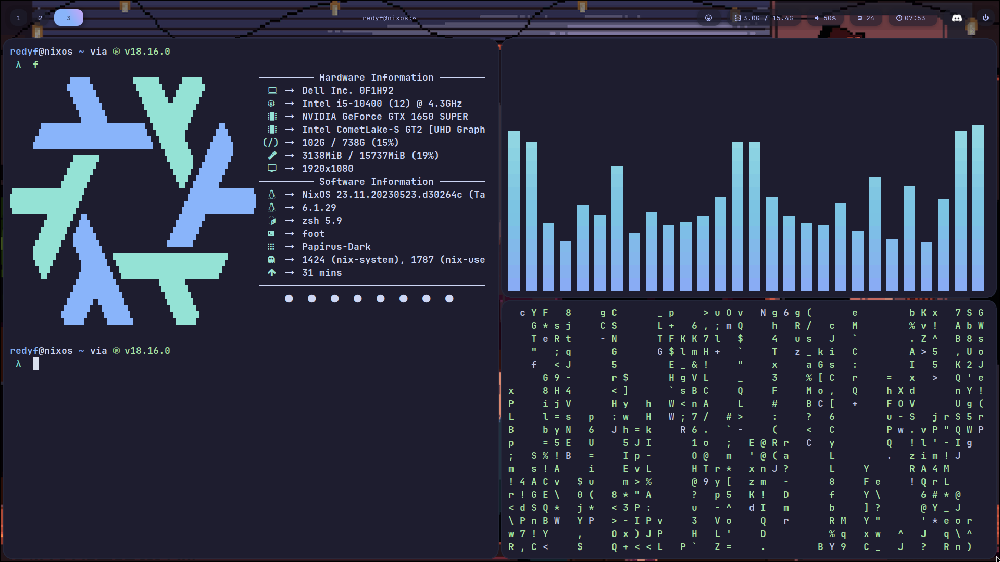
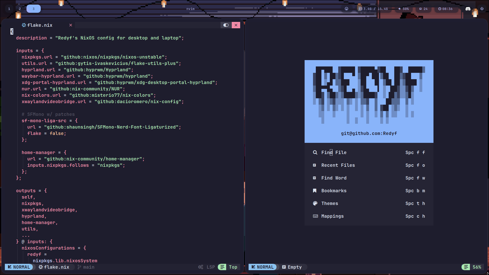

<h1 align="center">
<a href='#'></a>
  <br>
  <br>
  <div>
    <a href="https://github.com/Redyf/nixdots/issues">
        
    </a>
    <a href="https://github.com/Redyf/nixdots/stargazers">
        
    </a>
    <a href="https://github.com/PROxZIMA/.dotfiles/">
        
    </a>
    <a href="https://github.com/Redyf/nixdots/blob/master/LICENSE">
        
    </a>
    <br>
    </div>
   </h1>
   <br>

<div align="center">
<h1>
❄️ NixOS dotfiles ❄️
</h1>
</div>
<h2 align="center">Minha configuração para o NixOS. sinta-se livre para explorar!</h2>

## Agradecimentos especiais a:

- [NixOS Manual](https://nixos.org/manual/nixos/stable/)
- [ZerotoNix](https://zero-to-nix.com)
- [notusknot](https://github.com/notusknot)
- [Catppuccin](https://github.com/catppuccin)
- [Siduck76's NvChad](https://github.com/siduck76/nvchad/)
- [Sioodmy's dotfiles](https://github.com/sioodmy/dotfiles)
- [NotAShelf's dotfiles](https://github.com/NotAShelf/nyx)
- [AlphaTechnolog's dotfiles](https://github.com/AlphaTechnolog/nixdots)

<div align="center">


  <a href="https://github.com/Redyf/RedVim">Neovim</a>
</div>

```mint
⠀⠀   🌸 Setup / Hyprland 🌸
 -----------------------------------

 ╭─ Distro  -> NixOS
 ├─ Editor  -> NeoVim
 ├─ Browser -> Firefox / Chrome
 ├─ Shell   -> ZSH
 ╰─ Resource Monitor -> Btop

 ╭─ Model -> DELL XPS 8940
 ├─ CPU   -> Ryzen 7 4800H @ 4.3GHz
 ├─ GPU   -> NVIDIA GeForce GTX 1650 SUPER
 ╰─ Resolution -> 1920x1080

 ╭─ WM       -> Hyprland
 ├─ Terminal -> Foot
 ├─ Theme    -> Catppuccin-Mocha
 ├─ Icons    -> Papirus-Dark
 ├─ Font     -> JetBrains Mono Nerd Font
 ╰─ Hotel    -> Trivago

                        
```

## Comandos que você deve saber

- Faça um Rebuild e switch para mudar usar a nova configuração do sistema (no diretório de configuração):

```
rebuild
```

OR

```
sudo nixos-rebuild switch --flake .#yourComputer --fast
```

- Conecte o wifi (Substitua o que estiver dentro dos colchetes com suas informações)

```
iwctl --passphrase [passphrase] station [device] connect [SSID]
```

## Instalação

\*\* IMPORTANTE: Não use meu configuration.nix e/ou hardware-configuration.nix! Esses arquivos possuem as configurações específicas para meus drives e provavelmente não terão uma reação positiva no seu dispositivo!

Talvez não funcione perfeitamente logo após instalação, você foi avisado!

Para melhor segurança, verifique se os arquivos não causarão conflito com os seus atuais.

Pré-requisitos:

- [NixOS instalado e rodando](https://nixos.org/manual/nixos/stable/index.html#ch-installation)
- [Flakes habilitado](https://nixos.wiki/wiki/flakes)
- Root access

Clone o repo e cd nele:

```bash
git clone https://github.com/Redyf/nixdots ~/flake && cd ~/flake
```

Primeiro, crie uma configuração de hardware para seu sistema:

```bash
sudo nixos-generate-config
```

Depois você pode copiar isso para o diretório `nixos/` (nota: mude `yourComputer` com o que você quiser):

Você pode tanto adicionar como criar seu próprio output em `flake.nix` através do seguinte template:

```nix
nixosConfigurations = {
    # Agora, definir um novo sistema pode ser feito com uma linha.
    #                                Architecture   Hostname
    laptop = mkSystem inputs.nixpkgs "x86_64-linux" "laptop";
    desktop = mkSystem inputs.nixpkgs "x86_64-linux" "desktop";
    # ADD YOUR COMPUTER HERE! (feel free to remove mine)
    yourComputer = mkSystem inputs.nixpkgs "x86_64-linux" "yourComputer";
};
```

Por último, construa sua configuração com:

```bash
sudo nixos-rebuild switch --flake .#yourComputer
```

E isso deve ser tudo! Se tiver algum problema, pode criar uma issue (https://github.com/Redyf/nixdots/issues).

## Conclusão

E então essa foi minha configuração para o NixOS. O código está registrado sobre a licença MIT, então você pode usar ou distribuir o código como bem quiser. Se você quiser tirar alguma dúvida, pode me chamar no Discord: `Redyf#1337`.
